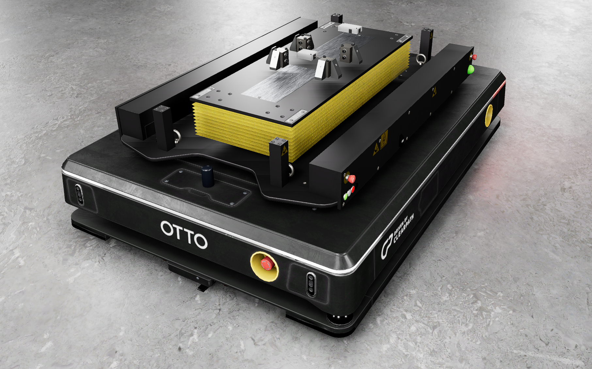
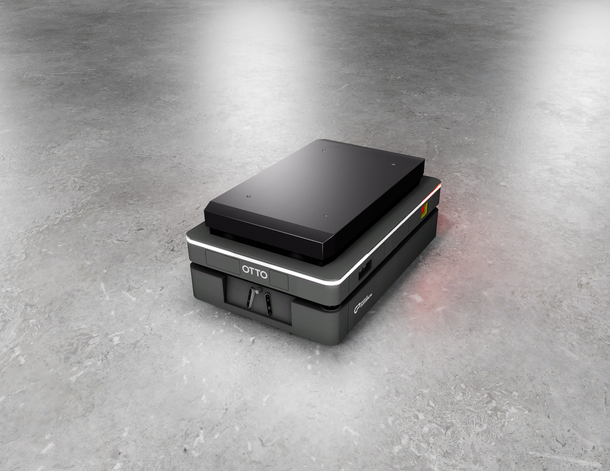
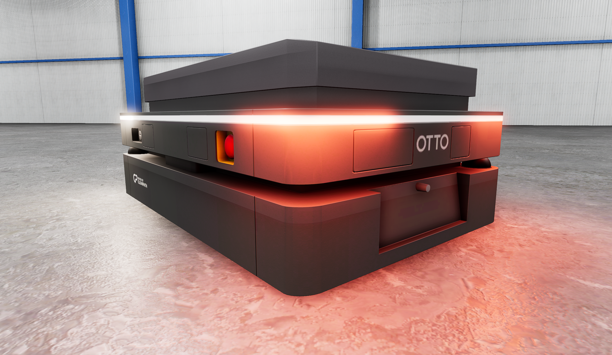

[![CC BY-NC-SA 4.0][cc-by-nc-sa-shield]][cc-by-nc-sa]

# OTTO 600 and OTTO 1500 Robots Gem for Open 3D Engine (O3DE)

## A bit of context

* [Open 3D Engine](https:://o3de.org) - an open source game & simulation engine. O3DE is extendable through modules called Gems. This is one of such Gems.
* [Robot Operating System (ROS)](https://docs.ros.org/en/rolling/index.html) - an open source middleware and, de facto, standard for robotics.
* [ROS2 Gem](https://github.com/o3de/o3de-extras/tree/development/Gems/ROS2) - an open source module for O3DE that enables simulation for robotics using modern ROS.
* [OTTO Motors](https://ottomotors.com/) - OTTO Motors is Rockwell Automation's AMR division, providing autonomous mobile robots (AMRs) for material handling inside manufacturing facilities and warehouses.

## Requirements
- Any O3DE project with the [O3DE ROS2 Gem](https://github.com/o3de/o3de-extras/tree/development/Gems/ROS2) enabled.

## Description
This gem contains the following assets:
- [OTTO 1500 v2](https://ottomotors.com/1500)
- [OTTO 600](https://ottomotors.com/600)
- High and low stands for OTTO 1500 v2
- Stand for OTTO 600

Please note that links and how parts of the robots combine might not be faithful to the actual design, as it is not public. Models are simplified and do not contain e.g. 

OTTO 1500:
- Intel RealSense Cameras
- Embedded 6-axis IMU
- SICK Microscan3 (360 FOV)

OTTO 600:
- Forward facing 3D Perception Cameras
- 6-axis IMU

## OTTO 1500 v2 - two models

### OTTO1500_Basic_platform.prefab - containing the small, static platform
 <!-- TODO: change image with new fixed model -->

---

### OTTO1500_Lifting_platform.prefab - containing the high-lifting platform
 <!-- TODO: change image with new fixed model -->
 <!-- TODO: change image with new fixed model -->

---
Movement of the platform can be manually steered using PhysX Debug gem or controlled from code using the Pid Motor Controller Component.

## OTTO 600
### OTTO600.prefab

## O3DE 
Robots are delivered as prefabs, containing models and physics, along with the following ROS components:
- ROS2 Frame
- ROS2 Robot Control
- ROS2 Skid Steering Vehicle Model
- ROS2 Lidar Sensor
- ROS2 Pid Motor Controller

## Acknowledgments

Models were created based on STL files kindly shared by OTTO Motors.

---

This work is licensed under a
[Creative Commons Attribution-NonCommercial-ShareAlike 4.0 International License][cc-by-nc-sa].

[![CC BY-NC-SA 4.0][cc-by-nc-sa-image]][cc-by-nc-sa]

[cc-by-nc-sa]: http://creativecommons.org/licenses/by-nc-sa/4.0/
[cc-by-nc-sa-image]: https://licensebuttons.net/l/by-nc-sa/4.0/88x31.png
[cc-by-nc-sa-shield]: https://img.shields.io/badge/License-CC%20BY--NC--SA%204.0-lightgrey.svg
