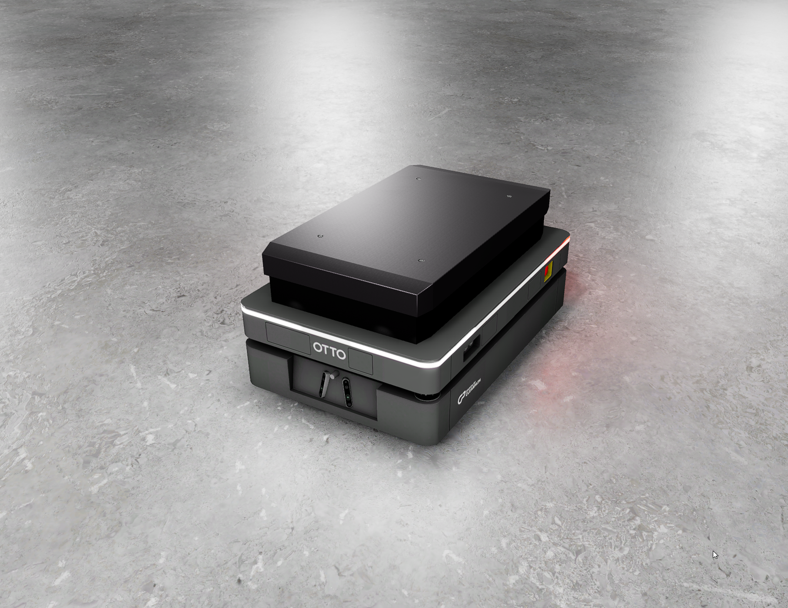
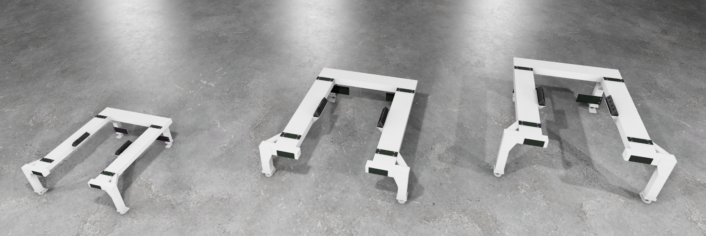
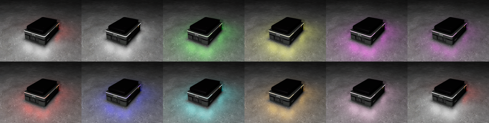

[![Apache License, Version 2.0][apache_shield]][apache]

# OTTO 600 and OTTO 1500 Robots Gem for Open 3D Engine (O3DE)

## A bit of context

* [Open 3D Engine](https:://o3de.org) - an open-source game & simulation engine. O3DE is extendable through modules called Gems. This is one of such Gems.
* [Robot Operating System (ROS)](https://docs.ros.org/en/rolling/index.html) - an open-source middleware and, de facto, standard for robotics.
* [ROS2 Gem](https://github.com/o3de/o3de-extras/tree/development/Gems/ROS2) - an open-source module for O3DE that enables simulation for robotics using modern ROS.
* [OTTO Motors](https://ottomotors.com/) - OTTO Motors is Rockwell Automation's AMR division, providing autonomous mobile robots (AMRs) for material handling inside manufacturing facilities and warehouses.

Please refer to [O3DE documentation](https://docs.o3de.org/docs/user-guide/gems/) to learn more about Gems and about registering Gems in the system and O3DE projects.

## Requirements
- Any O3DE project with the [O3DE ROS2 Gem](https://github.com/o3de/o3de-extras/tree/development/Gems/ROS2) enabled.

## Assets description
This Gem contains the following assets:
- [OTTO 1500 v2](https://ottomotors.com/1500)
- [OTTO 600](https://ottomotors.com/600)
- High and low stands for OTTO 1500 v2
- Stand for OTTO 600

O3DE models of the robots are based on the Unified Robot Description Format (URDF) files available in `workspace` folder. The models were converted to O3DE _prefabs_ using a built-in robot importer.
Please note that the structure of the models was developed independently from the actual design, which is not public, and, therefore, might differ. The robots are further simplified and do not include some sensors. In particular:

OTTO 1500:
- Forward- and backward-facing 3D Perception cameras
- Embedded 6-axis IMU
- SICK Microscan3 (360 FOV) scanner

OTTO 600:
- Forward-facing 3D Perception cameras
- Embedded 6-axis IMU

The assets are delivered as O3DE _prefabs_ in the following folder structure:
```
Assets
├── OTTO1500
│   ├── OTTO1500_Basic_platform.prefab
│   ├── OTTO1500_Lifting_platform.prefab
│   └── Stand
│       ├── StandHigh.prefab
│       └── StandLow.prefab
└── OTTO600
    ├── OTTO600.prefab
    └── Stand
        └── Otto600Stand.prefab
```

in which `OTTO1500_Basic_platform.prefab` and `OTTO1500_Lifting_platform.prefab` model OTTO1500 v2 robots with basic and high-lifting platforms respectively matching low and high stands stored in `StandLow.prefab` and `StandHigh.prefab` O3DE _prefabs_. `OTTO600.prefab` models OTTO 600 robot with a lifting platform that can be used with `Otto600Stand.prefab` stand. Robots contain visual models, colliders and physics, along with the following ROS components:
- ROS2 Frame
- ROS2 Robot Control
- ROS2 Skid Steering Vehicle Model
- ROS2 Lidar Sensor
- ROS2 PID Motor Controller

## Source code description

This Gem includes implementation to control lifting platforms of OTTO 600 and OTTO 1500 robots. Movement of the platform can be manually steered using PhysX Debug Gem or controlled from code using the Pid Motor Controller Component. Additionally, it includes the code to control the lights of OTTO 600. This can be done via ROS 2 interfaces directly from the source code or using command line ROS 2 tools as in the example below:

```
ros2 topic pub --once /base_link/color std_msgs/msg/String "{data: WHITE}"
```
The set of pre-defined colors includes _WHITE_,  _GREEN_,  _YELLOW_, _MAGENTA_,  _PURPLE_,  _RED_,  _BLUE_,  _CYAN_,  _ORANGE_, and _PINK_. The default configuration can be recovered using _default_ as the parameter.

## Screenshots


`OTTO1500_Basic_platform.prefab` (with a small, static platform)


`OTTO1500_Lifting_platform.prefab` (with a high-lifting platform at minimum position)


`OTTO1500_Lifting_platform.prefab` (with a high-lifting platform at maximum position)


`OTTO600.prefab` with a lifting platform at minimum position


`OTTO600.prefab` with a lifting platform at maximum position


`Otto600Stand.prefab`, `StandLow.prefab`, `StandHigh.prefab`


`OTTO600.prefab` models with different light configurations: _top row_: default, WHITE, GREEN, YELLOW, MAGENTA, PURPLE; _bottom row_: RED, BLUE, CYAN, ORANGE, PINK, default

## Acknowledgments

Models were created based on STL files kindly shared by OTTO Motors.

---

This work is licensed under [Apache License, Version 2.0][apache]. You may elect at your option to use the [MIT License][mit] instead. Contributions must be made under both licenses.

[apache]: https://opensource.org/licenses/Apache-2.0
[mit]: https://opensource.org/licenses/MIT
[apache_shield]: https://img.shields.io/badge/License-Apache_2.0-blue.svg
